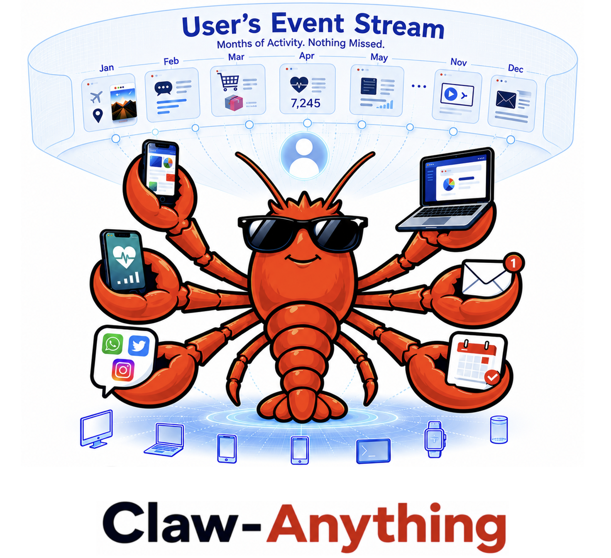
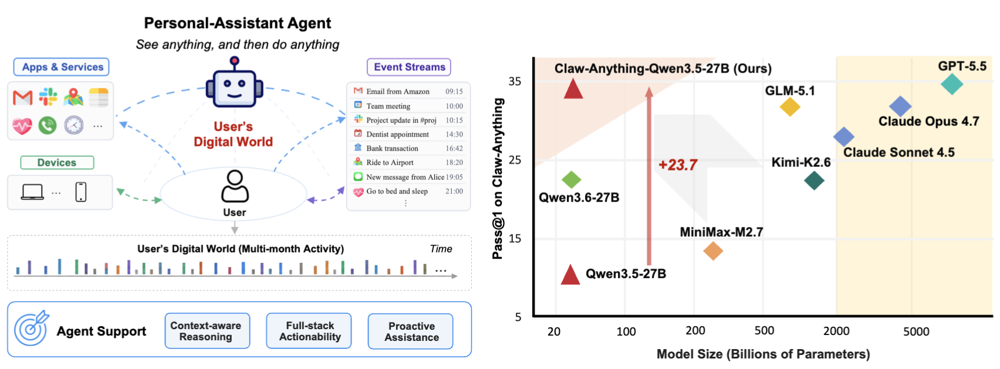
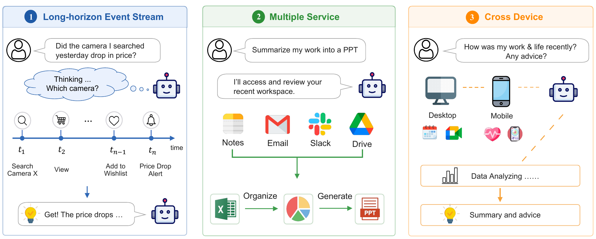
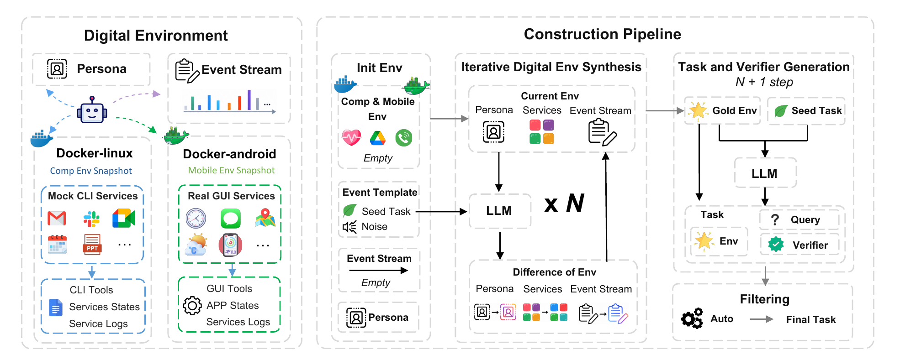

<div align="center">

<h1>Claw-Anything: See anything, and do anything. Scaling Agent Context. </h1>

[](https://arxiv.org/pdf/2605.26086)
[](https://huggingface.co/datasets/LiberCoders/Claw-Anything)
[](https://modelscope.cn/datasets/LiberCoders/Claw-Anything)
[](benchmark/)
[](#-quick-start)
[](https://github.com/LiberCoders/CLaw-Anything)

[English](README.md) | [中文](README.zh.md)



</div>

This repo is the official implementation of our paper — [Claw-Anything: Benchmarking Always-On Personal Assistants with Broader Access to the User's Digital World](https://arxiv.org/pdf/2605.26086) — and its follow-ups.

> [!IMPORTANT]
> _We believe the next leap for always-on LLM agents lies in scaling agent context — expanding the slice of the user's digital world an assistant can continuously perceive, reason over, and act on._

Claw-Anything operationalizes this view, evaluating always-on LLM agents across three axes of real-world context: **long-horizon event streams**, various **interconnected services**, and **cross-device interaction** (e.g., GUI and CLI). Even the strongest model, GPT-5.5, reaches only **34.5% pass@1**, revealing substantial capability gaps. Alongside the benchmark, we release an **automated data-generation pipeline** that produces **2,000 training environments** and boosts the base model by **23.7%**.

> <div align="center">
>
> Claw-Anything: Benchmarking Always-On Personal Assistants with Broader Access to the User's Digital World
>
> [Yusong Lin](https://github.com/icexiaoche), [Xinyuan Liang](https://github.com/xuan112358), [Haiyang Wang](https://haiyang-w.github.io/)<sup>†</sup>, [Qipeng Gu](https://openreview.net/profile?id=~Qipeng_Gu2), [Siqi Cheng](https://openreview.net/profile?id=~Siqi_Cheng3)<br>
> [Jiangui Chen](https://chriskuei.github.io/), [Shuzhe Wu](https://scholar.google.com/citations?user=CkqRXikAAAAJ&hl=en), [Feiyang Pan](https://feiyang.github.io/), [Lue Fan](https://lue.fan/), [Sanyuan Zhao](https://scholar.google.com/citations?user=t7dAaE8AAAAJ&hl=zh-CN)<sup>†</sup>, [Dandan Tu](https://scholar.google.com/citations?user=nf8bdFYAAAAJ&hl=zh-CN)<sup>†</sup>
>
><sup>†</sup> Corresponding authors.
>
> Primary contact: Yusong Lin (linyusong4@huawei.com), Haiyang Wang (haiyang.wang@huawei.com)
> </div>
>

<div align="center">



</div>


## News
- 🛠️ [2026-06-01] Support CLI + GUI automatic evaluation.
- 📄 [2026-05-26] The [arXiv](https://arxiv.org/pdf/2605.26086) preprint has been released.
- 🚀 [2026-05-26] **Data pipeline** has been released — the two-stage `build-persona` → `gen-eval` flow scales to 2,000 training environments and powers the benchmark's data generation.
- 📊 [2026-05-26] **Benchmark** and **Training Environments** has been released.

## Table of Contents

- [Overview](#-overview)
  - [Scaling Context via Three Dimensions](#-scaling-context-via-three-dimensions)
  - [Data Pipeline](#-data-pipeline)
  - [Benchmark](#-benchmark)
  - [Main Results](#-main-results)
- [Install](#-install)
- [Quick Start](#-quick-start)
  - [1. Run CLI tasks](#1-run-cli-tasks)
  - [2. Run CLI + GUI tasks](#2-run-cli--gui-tasks)
  - [3. Generate your own tasks](#3-generate-your-own-tasks)
  - [Extra Command](#-extra-command)
- [Repo Layout](#-repo-layout)
- [Acknowledgments](#-acknowledgments)
- [Citation](#-citation)
- [License](#-license)


## 💡 Overview

**Claw-Anything** is an end-to-end framework that does two things with one codebase:

1. **Benchmarks** AI agents on realistic, always-on personal-assistant tasks — long-horizon activity histories, dozens of interdependent backend services, and integrated GUI+CLI interaction across devices.
2. **Generates** those tasks automatically from a persona seed — months of simulated user activity, persistent fixtures, executable graders, and noise (irrelevant or conflicting events) included.

| Module | Role |
|--------|------|
| 🧪 **[`benchmark/`](benchmark/)** | **Evaluate** — 200 human-verified tasks split into `skill/` (the agent dynamically loads tools on demand) and `tool/` (the agent is pre-loaded with the full tool set) |
| 🏗️ **[`gen/`](src/claw_anything/gen/)** | **Build data** — `build-persona` + `gen-eval` two-phase pipeline; 2,000 training environments at scale |
| 🤖 **[`runner/`](src/claw_anything/runner/)** | **Execute** — Think → Act → Observe loop, OpenAI-compatible model backend, per-trial Docker sandbox with port isolation |
| 📋 **[`graders/`](src/claw_anything/graders/)** | **Score** — Multi-dimensional grading (completion · robustness · communication · safety) + LLM-as-judge + Pass^k aggregation |
| 🛠️ **[`mock_services/`](mock_services/)** | **Simulate** — 35 FastAPI mocked services (Gmail, Calendar, Slack, Notion, Feishu, WeChat, Zotero, ...) all sharing a frozen-time fixture base |

### 🔭 Scaling Context via Three Dimensions

Existing agent benchmarks expose only narrow, static slices of user state. Claw-Anything expands agent context along three axes simultaneously:

<div align="center">

</div>

- **Long-horizon event streams** — months of fine-grained user activity linking past and present, forcing agents to reason over an evolving timeline.
- **Interconnected services** — information is scattered across multiple stateful backends and signals from different services may conflict, demanding cross-service reconciliation and coordinated actions rather than single-API tool-use.
- **Cross-device interaction (GUI + CLI)** — devices fragment the user's digital world into silos; a truly attentive assistant must weave them together across heterogeneous GUI and CLI surfaces, acting as a connector across the user's daily life.

This expanded scope also unlocks evaluation of **proactive assistance**: tasks that reward acting *before* an explicit user request.


### 🏗️ Data Pipeline

<div align="center">

</div>

**Left — environment.** The environment comprises connected devices with system event streams and multiple services with persistent states and service-specific histories.

**Right — automated data pipeline.** From a persona-grounded initial state, the pipeline iteratively samples task or noise templates and uses an LLM-based simulator to adapt events and update the world state. A final simulation produces the task query, reference solution, and grader; automatic filtering yields task instances, with optional human verification for benchmark cases.

### 📊 Benchmark

| Benchmark | Event Stream | Device Interfaces | # Services (avg. / max.) | Proactive | # Context Length (words) | # Ins (Eval) | # Ins (Train) |
|---|:---:|:---:|:---:|:---:|---:|---:|---:|
| ClawBench       | ✗ | CLI | 1.6 / 5  | ✗ |   2.2k | 313 | 0 |
| WildClawBench   | ✗ | CLI | 0.5 / 3  | ✗ |   2.6k |  60 | 0 |
| PinchBench      | ✗ | CLI | 0.1 / 3  | ✗ |   1.7k |  53 | 0 |
| ClawMark        | ✗ | CLI | 3.9 / 5  | ✗ |   2.0k | 100 | 0 |
| QwenClawBench   | ✗ | CLI | 0.3 / 6  | ✗ |  12.1k | 100 | 0 |
| Claw-Eval       | ✗ | CLI | 1.3 / 6  | ✗ |   5.3k | 300 | 0 |
| **Claw-Anything (ours)** | ✓ | **CLI + GUI** | **10.1 / 18** | ✓ | **191.7k** | **200** | **2000** |

- **200 human-verified evaluation tasks** spanning patrol, decision-making, and multi-service coordination.
- **2,000 training environments** generated by the pipeline for downstream training.


### 🏆 Main Results

We evaluate state-of-the-art open- and closed-source models under a unified OpenHarness framework for fair comparison. **Bold** marks the best result in each column within each subgroup.

| Model | # Params | Score | Pass@1 | Pass@3 | Pass^3 | # Tokens (I / O) |
|---|:---:|:---:|:---:|:---:|:---:|:---:|
| ***Open-Source*** | | | | | | |
| Qwen3.5-27B | 27B | 0.50 | 9.8 | 19.0 | 2.0 | 83.8M / 0.9M |
| MiniMax-M2.7 | 229B | 0.52 | 13.5 | 28.5 | 3.5 | 79.0M / 1.1M |
| Qwen3.6-27B | 27B | 0.58 | 22.5 | 42.0 | 6.0 | 99.4M / 2.0M |
| Kimi-K2.6 | 1.1T | 0.57 | 22.8 | 44.0 | 6.5 | 178.1M / 2.3M |
| GLM-5.1 | 754B | 0.59 | 31.7 | 47.0 | **17.0** | 125.0M / 2.2M |
| **Claw-Anything-Qwen3.5-27B (ours)** | 27B | **0.61** | **33.5** | **52.0** | 15.5 | 117.8M / 1.1M |
| _Gain over Qwen3.5-27B_ | – | _+0.11_ | _+23.7_ | _+33.0_ | _+13.5_ | – |
| ***Closed-Source*** | | | | | | |
| Claude Sonnet 4.5 | – | 0.59 | 28.0 | 45.0 | 12.0 | 149.0M / 1.5M |
| Claude Opus 4.7 | – | 0.62 | 31.8 | 48.0 | 13.5 | 123.5M / 1.5M |
| GPT-5.5 | – | **0.65** | **34.5** | **53.5** | **20.0** | 77.7M / 0.9M |

- **State-of-the-art frontier models** still leave significant headroom on always-on personal-assistant tasks.
- **Our generated training environments are effective** — fine-tuning Qwen3.5-27B on 2,000 of them yields **Claw-Anything-Qwen3.5-27B**, very strong open-source result in this comparison (**+23.7** over the base model) and competitive with leading closed-source systems.


## 📦 Install

Requires **Python 3.11+** and (optionally) **Docker** for the trial-in-container sandbox. This project uses [**uv**](https://github.com/astral-sh/uv) for dependency management.

```bash
# 1. Install uv once (skip if already installed)
curl -LsSf https://astral.sh/uv/install.sh | sh

# 2. Clone the repo and enter the package directory
git clone https://github.com/LiberCoders/Claw-Anything.git
cd Claw-Anything

# 3. Create the venv and install the package
uv venv --python 3.11
source .venv/bin/activate
uv pip install -e ".[mock,sandbox]"

# 4. Configure the model endpoint
cp config.example.yaml config.yaml
# edit config.yaml: api_key / base_url / model_id
```

**Available extras** (declared in `pyproject.toml`):

| Extra | When to install | Pulls in |
|-------|-----------------|----------|
| `mock` | **Required** — needed by all `run` / `batch` / `gen-*` commands | `fastapi`, `uvicorn`, `pypdf`, `trafilatura`, `requests` |
| `sandbox` | **Recommended** — required for `--trial-in-container` | `docker` |
| `openharness` | Optional — only if `agent_type: openharness` or `openharness-ext` in `config.yaml` | `openharness-ai` |
| `dev` | Optional — only if you run `pytest tests/` | `pytest` |

So the typical install is `uv pip install -e ".[mock,sandbox]"`. Add `,dev` if you'll run the test suite, `,openharness` if you'll use the OH agent backend.

> After install you can either `source .venv/bin/activate` and call `claw-anything ...` directly, or use `uv run claw-anything ...` to let uv manage the environment for you.

That's all you need for CLI tasks run on the host. Sandboxed runs additionally need a one-time `claw-anything build-image` — introduced where it's first used in [Quick Start](#-quick-start) below.


## 🚀 Quick Start

Claw-Anything has three things you can *do* with it:

1. **[Run CLI tasks](#1-run-cli-tasks)** — the 150 CLI benchmark tasks (or any single task). Needs only the install above + Docker. Start here.
2. **[Run CLI + GUI tasks](#2-run-cli--gui-tasks)** — adds the 50 Android GUI tasks for the full 200-task benchmark. Needs an Android device image + the OH-Ext agent; a minimal working setup first, full details after.
3. **[Generate your own tasks](#3-generate-your-own-tasks)** — turn a persona YAML into a populated digital world plus eval tasks with executable graders.

### 1. Run CLI tasks

#### Evaluate the CLI benchmark

OpenHarness agent (recommended; the backend used for all paper results — model endpoint comes from `oh-settings.json`, not `config.yaml`):

```bash
claw-anything build-image --agent openharness          # one-time
cp examples/oh-settings.example.json oh-settings.json  # one-time; fill in api_key / base_url / model

# Both CLI subsets (150 tasks: skill + tool)
claw-anything batch \
  --config config.yaml \
  --agent openharness \
  --oh-settings oh-settings.json \
  --cli-only \
  --trials 3 --parallel 10
```

Loop agent (lightweight alternative; model endpoint read straight from `config.yaml`):

```bash
claw-anything build-image --agent loop                 # one-time

claw-anything batch --config config.yaml --cli-only --trials 3 --parallel 10
```

Output:

```
traces/<agent>_<model>_<ts>/
├── skill/  # 100 tasks, tools loaded on demand (prompt.skill_mode = true)
│   ├── batch_results.json
│   └── batch_summary.json
└── tool/   # 50 tasks, full tool set pre-loaded
    ├── batch_results.json
    └── batch_summary.json
```

To run one subset (or any task directory): add `--tasks-dir benchmark/skill`.

#### Single tasks, re-grading, resuming

```bash
# Single task (run works without a container; add --trial-in-container for the sandbox)
claw-anything run --task examples/ready_to_run/T001_demo --config config.yaml
claw-anything run --task examples/ready_to_run/T001_demo --config config.yaml \
  --agent openharness --trial-in-container --oh-settings oh-settings.json

# Re-grade an existing trace (no agent re-run)
claw-anything grade --trace traces/<dir>/<trace>.jsonl --task examples/ready_to_run/T001_demo

# Resume a previous batch / re-run only failures
claw-anything batch --tasks-dir benchmark/skill --trace-dir traces/<prev_run>/ --continue
claw-anything batch --tasks-dir benchmark/skill --trace-dir traces/<prev_run>/ --rerun-errors
```

### 2. Run CLI + GUI tasks

GUI tasks (the `benchmark/gui/` subset) drive a real Android device via `adb`, require the **OH-Ext agent**, and need two model endpoints (a *planner* + a *GUI-grounding* vision model, canonically **GUI-Owl**). Follow the quick path first; details and alternatives come after.

#### Quick path: a minimal working GUI run

**Step 1 — pull a device image.** Two backends exist; pick by what your host kernel offers (details in [Choosing the Android backend](#choosing-the-android-backend)). If you have `/dev/kvm`, use `kvm`; otherwise `redroid` works on any box with the binder kernel module and boots in seconds:

```bash
# redroid (no KVM needed)
docker pull ghcr.io/libercoders/redroid-claw_anything:13
# — or — kvm (requires /dev/kvm)
docker pull ghcr.io/libercoders/claw-anything:latest
```

**Step 2 — install adb on the host** (the host injects GUI state into the device before each trial; the trial container already ships its own `adb`):

```bash
wget https://dl.google.com/android/repository/platform-tools-latest-linux.zip
unzip platform-tools-latest-linux.zip
export PATH="$PWD/platform-tools:$PATH"
adb version    # → Android Debug Bridge version 1.0.41
```

**Step 3 — build the OH-Ext runner image** (one-time; not published to a registry). Point `ADB_PATH` at the platform-tools `adb` from step 2 — the build auto-clones [OpenHarnessExtended](https://github.com/LiberCoders/OpenHarnessExtended) into `vendor/`:

```bash
ADB_PATH=$PWD/platform-tools/adb \
  claw-anything build-image --agent openharness-ext   # → claw-anything-oh-ext:latest
```

**Step 4 — minimal configuration.** Add an `android` block to `config.yaml` so the framework auto-launches one device container per run:

```yaml
android:
  backend: redroid                          # or 'kvm' to match the image you pulled
  redroid_image: redroid-claw_anything:13   # for kvm: emulator_image: claw_anything:latest
  auto_launch_count: 1
```

Copy [`examples/oh-settings.example.json`](examples/oh-settings.example.json) to `oh-settings.json` and fill in the two endpoints: the planner under `profiles.default` (`base_url`, model name) and the GUI-grounding model under `mobile_gui.gui_backend`. Leave `mobile_gui.device_serial` empty — it's auto-filled per trial.

**Step 5 — run.** Smoke-test one GUI task, then the GUI subset or the full 200-task benchmark:

```bash
# One GUI task (smoke test)
claw-anything run \
  --task benchmark/gui/TGUI01_myexpenses_overbudget_finance_email \
  --config config.yaml \
  --agent openharness-ext \
  --trial-in-container \
  --oh-settings oh-settings.json

# GUI subset only (50 tasks)
claw-anything batch \
  --tasks-dir benchmark/gui \
  --config config.yaml \
  --agent openharness-ext \
  --oh-settings oh-settings.json \
  --trials 3 --parallel 4         # parallel ≤ android.auto_launch_count (one device per worker)

# Full benchmark (200 tasks: skill + tool + gui)
claw-anything batch \
  --config config.yaml \
  --oh-settings oh-settings.json \
  --trials 3 \
  --parallel 10
```

A healthy run logs the device pool booting at the start (`[emu-pool] booted: …` for `kvm`, `[redroid-pool] ready (rooted): …` for `redroid`) and `… stop_all: removed N container(s)` at the end; a per-trial score block prints `completion / robustness / communication / safety / task_score / passed`. With the full suite, traces gain a `gui/` subdirectory next to `skill/` and `tool/`.

If anything fails, see [Troubleshooting](#troubleshooting); the sections below explain each moving part and its alternatives.

#### Architecture: what talks to what

A GUI trial has **four moving parts**:

```
┌─────────────────────────────────────────────────────────────────────┐
│ host                                                                  │
│                                                                       │
│  claw-anything CLI ──┬── device pool ────▶ device container           │
│  (orchestrator)      │   (auto-launch)     kvm:     claw_anything      │
│                      │                     redroid: redroid-claw…      │
│                      │                          ▲                     │
│                      └── trial container ───adb─┘                     │
│                          (claw-anything-oh-ext)                       │
│                            │         │                                │
│                   planner LLM   GUI-grounding LLM                     │
│                   (OpenAI API)  (GUI-Owl, vision)                     │
└─────────────────────────────────────────────────────────────────────┘
```

1. **Orchestrator** — the `claw-anything` CLI on the host. Does GUI state injection (`init_gui_task()` writes calendar events, contacts, etc. into the device before the agent starts), workspace prep, config rewriting, and grading.
2. **Device** — a rooted Android instance. Either you pre-launch it (`emulator_pool`) or the framework auto-launches it in a container (`auto_launch_count`). The backend (`android.backend`) selects **`kvm`** (QEMU AVD, `claw_anything:latest`) or **`redroid`** (Android-in-container, `redroid-claw_anything`).
3. **Trial runner** — the `claw-anything-oh-ext` container that runs the OH-Ext agent and drives the device over `adb`.
4. **Two model endpoints**, both declared in `--oh-settings`:
   - **planner** — an OpenAI-compatible chat model (the agent's "brain").
   - **GUI-grounding** — a vision model that turns a screenshot into a tap/swipe coordinate. The canonical choice is **GUI-Owl** (`gui_plus` backend).

#### Choosing the Android backend

Pick **one** Android backend based on what your host kernel exposes:

| Backend | Host requirement | Why | Check |
|---|---|---|---|
| **`kvm`** (default) | `/dev/kvm` present, CPU has `vmx`/`svm` | The QEMU Android emulator needs hardware virtualization; without it the AVD never finishes booting in reasonable time | `ls /dev/kvm && egrep -c '(vmx\|svm)' /proc/cpuinfo` |
| **`redroid`** | binder kernel module loaded (`binder_linux`); **no KVM needed** | redroid runs Android directly on the host kernel (binder/ashmem), so it works on boxes without hardware virtualization (most cloud CI, dev laptops) | `grep -w binder /proc/filesystems \|\| lsmod \| grep binder` |

Both device images ship the same rooted Android with every target app pre-installed (Fossify Calendar/Messages/Notes, Loop Habits, My Expenses, Markor, OpenTracks, Gmail, …), so tasks and graders work identically against either — only the device source differs.

#### OH-Ext image build details

`claw-anything build-image --agent openharness-ext` wraps `scripts/build_oh_ext_image.sh`. Two knobs:

- `ADB_PATH` (**required**) — must point at the **official** platform-tools `adb` (a self-contained binary); a distro `adb` that links `libadb.so.0` fails inside the slim image.
- `OH_EXT_DIR` (optional) — an already-cloned [OpenHarnessExtended](https://github.com/LiberCoders/OpenHarnessExtended) working copy; when unset, the build auto-clones into `vendor/`. The working copy must be on branch **`main-clawgui`** — the build script prints a warning otherwise.

```bash
# Full control — call the script directly:
OH_EXT_DIR=$HOME/code/OpenHarnessExtended \
ADB_PATH=$PWD/platform-tools/adb \
  scripts/build_oh_ext_image.sh
```

#### `config.yaml` and `oh-settings.json` in full

**`config.yaml`** — the orchestrator config. The `model` / `judge` blocks here are used for the **loop** agent and for the **LLM-judge grader**; the OH-Ext agent ignores `model` (it reads its own `--oh-settings`):

```yaml
model:                       # used by loop agent + (model_id only) for trace-dir naming
  api_key: ${OPENAI_API_KEY}
  base_url: https://api.openai.com/v1
  model_id: gpt-4o-mini

judge:                       # LLM-as-judge for communication-quality scoring
  api_key: ${OPENAI_API_KEY} # ⚠️ a 401 here only disables judge scoring; rule-based dims still grade
  base_url: https://api.openai.com/v1
  model_id: gpt-4o-mini
  enabled: true

agent:
  agent_type: loop           # CLI default; GUI runs override to openharness-ext on the command line

logging:
  llm_log: false             # off by default; set true to persist every LLM interaction (see note below)

# ── Android device — pick ONE backend block ──

# (a) KVM emulator (default; requires /dev/kvm)
android:
  backend: kvm
  emulator_image: claw_anything:latest
  auto_launch_count: 1
  container_adb_port: 5556
  host_port_start: 5556
  boot_timeout_s: 600

# (b) redroid (no KVM; needs host binder modules)
# android:
#   backend: redroid
#   redroid_image: redroid-claw_anything:13
#   auto_launch_count: 1
#   boot_timeout_s: 300

# Or skip auto-launch entirely and point at an already-running device
# (backend-agnostic — a static pool always wins over auto-launch):
# android:
#   emulator_pool: ["127.0.0.1:5555"]   # e.g. a redroid container you started by hand
#                                       # TCP-shaped serials trigger `adb connect` before each trial
```

> **Logging every LLM interaction (`logging.llm_log`)** — off by default. Set `logging.llm_log: true` (or export `CLAW_ANYTHING_LLM_LOG=1`, which overrides the config) to persist the full request/response payload of **every** LLM call to `<trace_dir>/.../llm_logs/<source>.jsonl`, one file per source: `runner.jsonl` (the agent's step-by-step calls), `judge.jsonl` (the LLM-judge grader), and the task-generation pipeline (`analyzer`, `task_generator`, `grader_generator`, …). Each record carries the exact `messages` sent and the model's raw `response`. Useful for **inspecting the agentic process** turn-by-turn, debugging tool calls, accounting for token usage, or **harvesting (input, output) pairs to train/distill your own agent or judge model**. It is opt-in because these payloads grow large quickly and most eval runs don't need them.

**`oh-settings.json`** — the OH-Ext agent's self-contained config (copy [`examples/oh-settings.example.json`](examples/oh-settings.example.json)). This is where the **two model endpoints** go. The framework auto-fills `mobile_gui.device_serial` per trial and rewrites `localhost`→`host.docker.internal` for container mode, so you only supply the endpoints:

```jsonc
{
  "active_profile": "default",
  "api_key": "EMPTY",
  "max_tokens": 8192,
  "mobile_gui": {
    "device_transport": "adb",
    "device_serial": "",                       // ← auto-filled per trial; leave empty
    "adb_path": "/usr/local/bin/adb",          // adb inside the OH-Ext image
    "gui_backend": {                           // ← the GUI-grounding (vision) model
      "type": "gui_plus",
      "base_url": "http://localhost:7267/v1",  // GUI-Owl endpoint
      "api_key": "EMPTY",
      "model": "GUI-Owl-1.5-4B-Instruct",
      "tls_verify": false,
      "max_tokens": 2048,
      "history_n": 4
    }
  },
  "profiles": {
    "default": {                               // ← the planner (the agent's brain)
      "label": "planner",
      "provider": "openai",
      "api_format": "openai",
      "auth_source": "openai_api_key",
      "default_model": "your-planner-model",
      "last_model": "your-planner-model",
      "base_url": "http://localhost:7266/v1",  // planner endpoint
      "allowed_models": ["your-planner-model"]
    }
  }
}
```

Both endpoints must be **reachable from the trial container** via `host.docker.internal` (the launcher rewrites `localhost`→`host.docker.internal` and adds `--add-host=host.docker.internal:host-gateway`). If your models bind to `127.0.0.1` only, bridge them to the docker gateway (e.g. a small TCP forwarder on `172.17.0.1:PORT → 127.0.0.1:PORT`).

> Self-hosting the models with vLLM? A typical pair:
> ```bash
> # planner (any tool-capable chat model)
> vllm serve <planner-model> --served-model-name your-planner-model --port 7266 \
>   --enable-auto-tool-choice --tool-call-parser hermes
> # GUI grounding
> vllm serve GUI-Owl-1.5-4B-Instruct --served-model-name GUI-Owl-1.5-4B-Instruct --port 7267 \
>   --limit-mm-per-prompt '{"image": 5}'
> ```

#### Clean up

`claw-anything cleanup` removes both the trial containers (`app=claw-anything`) and any leaked device containers (`app=claw-anything-emu`, used by both the `kvm` and `redroid` pools). The pool already tears its containers down in a `finally` block, so cleanup is only needed after a hard crash / `Ctrl-C`.

```bash
claw-anything cleanup
```

#### Troubleshooting

| Symptom | Cause / fix |
|---|---|
| `[emu-pool]` (kvm) never prints "booted", times out | No KVM, or `boot_timeout_s` too low. Verify `/dev/kvm`; first boot of `claw_anything:latest` takes ~3 min. On a host without KVM, switch to `android.backend: redroid` instead. |
| `[redroid-pool]` container exits / never boots | Host binder modules missing — `grep -w binder /proc/filesystems`; load with `sudo modprobe binder_linux`. The container needs `--privileged` (the pool already passes it). |
| Trial container can't reach the model | `base_url` points at `localhost` but the model only binds `127.0.0.1`. Bridge it onto the docker gateway `172.17.0.1`, or bind the server on `0.0.0.0`. |
| `adb connect` fails inside the trial | The emulator's adb is bound to `127.0.0.1` in its container; the launcher expects it reachable on `host.docker.internal:<port>`. Ensure the host-port mapping (or bridge) exposes it on `0.0.0.0`. |

### 3. Generate your own tasks

The two-phase pipeline turns a single persona YAML into a fully populated digital world plus eval tasks with executable graders — the same pipeline that produced the 2,000 released training environments.

```bash
# Phase 1 — build a gold environment from a persona
claw-anything build-persona \
  --persona personas/sarah_chen_pm_persona.yaml \
  --seed-tasks seed_tasks/ \
  --rounds 30 \
  --seed-noise seed_noise/ \
  --noise-ratio 2 \
  --output gold_envs/sarah_chen_pm/ \
  --config config.yaml

# Phase 2 — generate eval tasks from the gold environment
claw-anything gen-eval \
  --env gold_envs/sarah_chen_pm/ \
  --seed-tasks seed_tasks/ \
  --output gen_tasks/sarah_chen_pm_simple/ \
  --max-tasks 20 \
  --difficulty simple \
  --execution-date 2026-04-03 \
  --config config.yaml

# Then evaluate the generated tasks
claw-anything batch \
  --tasks-dir gen_tasks/sarah_chen_pm_simple/ \
  --config config.yaml \
  --trials 3 --parallel 10
```

### 🛠️ Extra Command

| Group    | Command / Script                  | Purpose |
|----------|-----------------------------------|---------|
| Run      | `run`                             | Run an agent on a single task (loop: `--trial-in-container`; OH: `--agent openharness[‑ext] --trial-in-container --oh-settings`) |
| Run      | `batch`                           | Run all tasks under `--tasks-dir` in parallel, N trials each (always in containers — no `--trial-in-container` flag). **Defaults to the full 200-task suite (skill + tool + gui)** when `--tasks-dir` is omitted; pass `--cli-only` to run just the CLI subsets (150 tasks). Supports `--continue` and `--rerun-errors` against an existing `--trace-dir`. |
| Run      | `grade`                           | Re-grade an existing trace JSONL against a task |
| Run      | `list`                            | List task ids under `--tasks-dir` |
| Images   | `build-image`                     | Build the trial-in-container image for the selected agent (`--agent loop\|openharness\|openharness-ext`, default: `openharness-ext`) |
| Images   | `scripts/build_{loop,oh,oh_ext}_image.sh` | Lower-level shell builders. `build_oh_ext_image.sh` needs `OH_EXT_DIR` and `ADB_PATH`. |
| Sandbox  | `cleanup`                         | Remove all `claw-anything` trial containers (label `app=claw-anything`) |
| Generate | `build-persona`                   | **Phase 1** — adapt seed tasks to a persona, build a gold environment |
| Generate | `gen-eval`                        | **Phase 2** — generate evaluation tasks from a gold environment |

Common `run` flags: `--agent {loop, openai-compat, openharness, openharness-ext}` · `--trial-in-container` · `--docker-image` (override image name) · `--oh-settings PATH` (OH-only) · `--oh-disable-builtin-tools` (only expose claw-anything tools, deny all OH builtins) · `--proxy URL` (for model / judge API traffic) · `--judge-model` / `--no-judge`.

`claw-anything <cmd> --help` shows full options for each command.


## 📁 Repo Layout

```
src/claw_anything/      # core package
  ├─ cli.py             # all CLI subcommands
  ├─ runner/            # container_launcher, ServiceManager, dispatchers, OH plugin gen
  ├─ agents/            # agent backends (loop · openharness · openharness-ext)
  ├─ task/mobile_gui/   # Android GUI init + adb inject helpers (calendar / contacts / …)
  ├─ graders/           # grading framework (rule + LLM judge)
  ├─ gen/               # build-persona + gen-eval pipeline
  ├─ models/            # pydantic models (task, message, trace, scoring)
  └─ trace/             # JSONL trace reader/writer
mock_services/          # FastAPI mock services (CLI + GUI app shadows)
docker/oh/              # patch_*.py — build-time patches baked into the OH image
                        #   patch_print_mode_usage.py    — surface per-turn `usage` in stream-json
                        #   patch_openai_client.py       — keep `stream_options.include_usage` with tools
                        #   patch_environment_date.py    — honour CLAW_TASK_EXECUTION_DATE env var
scripts/                # build_{loop,oh,oh_ext}_image.sh
Dockerfile.{loop,oh,oh_ext}   # one Dockerfile per agent backend
benchmark/              # 200 human-verified tasks
  ├─ skill/             # 100 skill-mode CLI tasks (agent loads tools dynamically on demand)
  ├─ tool/              # 50 tool-mode CLI tasks  (agent is pre-loaded with the full tool set)
  └─ gui/               # 50 CLI + GUI tasks
personas/               # hand-written persona YAMLs (input to build-persona)
seed_tasks/             # abstract task templates (M000–Mxxx)
seed_noise/             # noise templates injected during persona build
gold_envs/              # outputs of build-persona (persona + fixtures)
gen_tasks/              # outputs of gen-eval
examples/               # minimal runnable examples + oh-settings.example.json (OH settings template)
template/               # task.yaml / grader.py templates for authors
docs/                   # task authoring guides
```


## 🙏 Acknowledgments

Claw-Anything is built on top of [**Claw-Eval**](https://claw-eval.github.io/) — we reuse its task abstraction, mock-service scaffolding, and grader conventions as the starting point of this work, and extend them along three context-scaling axes (long-horizon event streams, interconnected services, and cross-device GUI + CLI) with an automated data-generation pipeline. We thank the Claw-Eval authors for open-sourcing a clean foundation to build on.

We also thank the broader community behind the open-source LLMs, agent harnesses, and mock-service inspirations that made this benchmark possible.


## 📝 Citation

```bibtex
@article{lin2026clawanything,
  title   = {Claw-Anything: Benchmarking Always-On Personal Assistants with Broader Access to User’s Digital World},
  author  = {Lin, Yusong and Liang, Xinyuan and Wang, Haiyang and Gu, Qipeng and Cheng, Siqi and Chen, Jiangui and Wu, Shuzhe and Pan, Feiyang and Fan, Lue and Zhao, Sanyuan and Tu, Dandan},
  year    = {2026},
  journal = {arXiv preprint arXiv:2605.26086}
}
```


## 📄 License

This project is licensed under the [MIT License](LICENSE).
