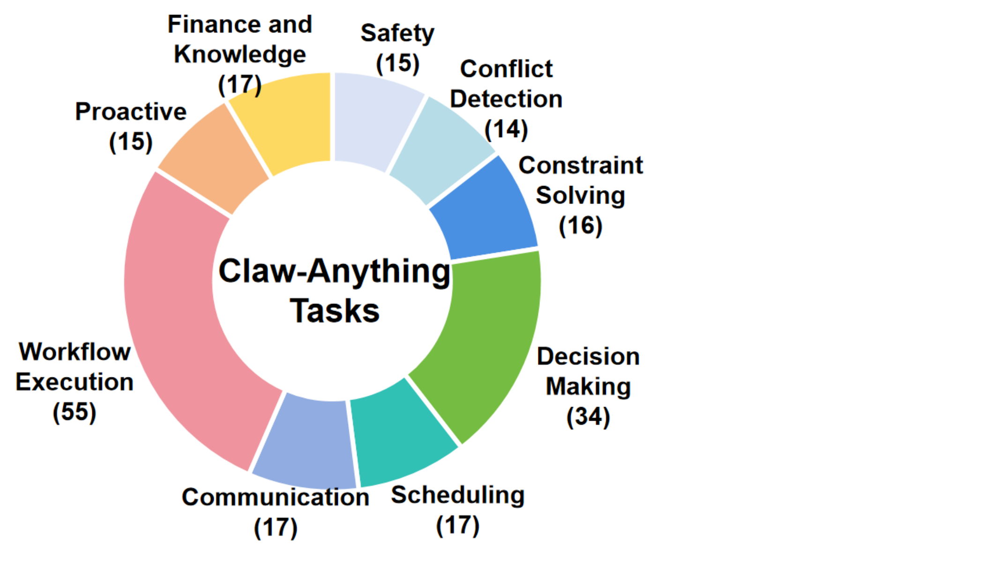

<div align="center">

<h1>Claw-Anything：面向"全天候个人助理"的智能体评测基准与数据生成框架</h1>

[](https://www.python.org/downloads/release/python-3110/)
[](LICENSE)
[](#-引用)
[](benchmark/)
[](#-快速上手)

[English](README.md) | [中文](README.zh.md)

</div>

<div align="center">

<b>一个框架同时完成两件事：评测个人助理智能体，<i>并</i>自动生成它们被评测时所用的数据。</b>


</div>

## 最新进展

- 📊 **全新 benchmark 套件发布** —— `benchmark/skill/`（100 个 skill 模式任务）+ `benchmark/tool/`（50 个 tool 模式任务）。`claw-anything batch` 不带 `--tasks-dir` 时默认跑完整套件，端到端一条命令搞定。
- 📄 **论文即将发布** —— arXiv 预印本上线后会在此挂出链接。
- 🚀 **两阶段管线（`build-persona` → `gen-eval`）** 规模化产出 2,000 个训练环境，是 benchmark 数据生成的主引擎。

## 目录

- [项目概览](#-项目概览)
- [上下文的三个维度](#-上下文的三个维度)
- [架构](#-架构)
- [安装](#-安装)
- [快速上手](#-快速上手)
  - [运行 benchmark 套件](#运行-benchmark-套件)
  - [运行单个任务](#运行单个任务)
  - [生成你自己的任务](#生成你自己的任务)
- [Benchmark 数据](#-benchmark-数据)
- [命令行速查](#-命令行速查)
- [代码结构](#-代码结构)
- [编写任务](#-编写任务)
- [引用](#-引用)
- [License](#-license)


## 💡 项目概览

**Claw-Anything** 用同一套代码同时做两件事：

1. **评测**：在贴近真实"全天候个人助理"场景下评测智能体 —— 长时段活动历史、数十个相互依赖的后端服务、跨设备的 GUI+CLI 协同。
2. **生成**：从一份 persona 描述自动生成上述任务 —— 自动模拟数月的用户活动、持久化 fixture、可执行的 grader，并刻意引入噪声（无关事件 / 冲突信号）。

执行评测的模拟器同时也是生产数据的引擎，把"基准评测"与"数据集构造"合到同一个工具链。

| 模块 | 角色 |
|--------|------|
| 🧪 **[`benchmark/`](benchmark/)** | **评测** —— 200 个人工核验的任务，分为 `skill/`（100 个 skill 模式巡视类任务，需读取活动日志）和 `tool/`（50 个 tool 模式任务，纯 mock-service API 调用） |
| 🏗️ **[`gen/`](src/claw_anything/gen/)** | **数据生成** —— `build-persona` + `gen-eval` 两阶段管线，可规模化产出 2,000 个训练环境 |
| 🤖 **[`runner/`](src/claw_anything/runner/)** | **执行** —— Think→Act→Observe 循环，OpenAI 兼容后端，每 trial 一个 Docker 沙箱+端口隔离 |
| 📋 **[`graders/`](src/claw_anything/graders/)** | **评分** —— 多维度评分（completion · robustness · communication · safety）+ LLM 评判 + 跨 trial Pass^k 聚合 |
| 🛠️ **[`mock_services/`](mock_services/)** | **模拟服务** —— 35 个 FastAPI 服务（Gmail、Calendar、Slack、Notion、飞书、微信、Zotero ……），共享同一套冻结时间的 fixture 基座 |


## 🔭 上下文的三个维度

现有评测往往只暴露用户状态的一小片。Claw-Anything 沿三个维度同时扩展智能体的上下文：

<div align="center">

</div>

- **长时段事件流** —— 数月级的细粒度活动记录，串起过去与现在，支持基于演进上下文的推理。
- **相互依赖的后端服务** —— 任务需要跨服务协调，而不是单一 API 调用。
- **跨设备 GUI + CLI** —— 异质交互界面让智能体整合分布式信息和动作。

扩展后的上下文范围还解锁了对**主动协助（proactive assistance）** 的评测：奖励在用户显式请求**之前**就采取行动的智能体。


## 🏗️ 架构

<div align="center">

</div>

**左侧 —— 环境**：相互连接的设备产生系统级事件流；多个服务持有持久状态与各自的历史。

**右侧 —— 自动化数据管线**：从一个 persona 锚定的初始状态出发，迭代采样任务模板与噪声模板，由 LLM 模拟器更新事件与世界状态。最终一轮模拟产出任务问题、参考解和 grader；自动过滤后得到任务实例，benchmark 任务再走一道人工核验。


## 📦 安装

需要 **Python 3.11+**，开 trial-in-container 沙箱时额外需要 **Docker**。本项目用 [**uv**](https://github.com/astral-sh/uv) 管理依赖。

```bash
# 1. 一次性安装 uv（已装可跳过）
curl -LsSf https://astral.sh/uv/install.sh | sh

# 2. clone 仓库并进入包目录
git clone https://github.com/Haiyang-W/Daily-Bench.git
cd Daily-Bench/claw-anything

# 3. 创建虚拟环境并安装依赖
uv venv --python 3.11
source .venv/bin/activate
uv pip install -e ".[mock,sandbox]"

# 4. 配置模型 endpoint
cp config.example.yaml config.yaml
# 编辑 config.yaml：api_key / base_url / model_id

# 5. 构建 trial-in-container 镜像（一次性；按使用的 agent backend 选）
claw-anything build-image                       # 默认 --agent openharness-ext（镜像 claw-anything-oh-ext）
claw-anything build-image --agent loop          # 最精简镜像：claw-anything-loop
claw-anything build-image --agent openharness   # vanilla OH 镜像：claw-anything-oh
```

> 构建 OH-Ext 镜像需要 `adb` 二进制和 OpenHarnessExtended 源码。要么让脚本把 OH-Ext clone 到 `vendor/`、仅提供 `ADB_PATH`，要么两者都显式指定：
> ```bash
> OH_EXT_DIR=$HOME/code/OpenHarnessExtended \
> ADB_PATH=$HOME/android-sdk/platform-tools/adb \
>   scripts/build_oh_ext_image.sh
> ```

**可选 extras**（定义在 `pyproject.toml`）：

| Extra | 何时安装 | 引入的依赖 |
|-------|---------|-----------|
| `mock` | **必装** —— 所有 `run` / `batch` / `gen-*` 命令都需要 | `fastapi`、`uvicorn`、`pypdf`、`trafilatura`、`requests` |
| `sandbox` | **建议** —— `--trial-in-container` 必需 | `docker` |
| `web` | 可选 —— 仅在用到 `web_real` mock 服务时需要 | `trafilatura`、`requests` |
| `openharness` | 可选 —— 仅在使用 `agent_type: openharness` 或 `openharness-ext` 时需要 | `openharness-ai` |
| `dev` | 可选 —— 仅在跑 `pytest tests/` 时需要 | `pytest` |

所以**典型安装命令**就是 `uv pip install -e ".[mock,sandbox]"`。要跑测试套件再加 `,dev`；要用 OH agent 后端再加 `,openharness`。

> 装完后既可以 `source .venv/bin/activate` 然后直接用 `claw-anything ...`，也可以用 `uv run claw-anything ...` 让 uv 自动接管环境。


## 🚀 快速上手

### 运行 benchmark 套件

Benchmark 拆成两个子集，各自需要不同的 prompt 模式。**一条命令**跑完整套件 —— `claw-anything batch` 不带 `--tasks-dir` 时默认跑全套（skill 子集开 `skill_mode`，tool 子集关 `skill_mode`），各自写到独立的 trace 子目录：

```bash
# 跑完整 benchmark（100 个 skill + 50 个 tool 任务）
claw-anything batch \
  --config config.yaml \
  --trial-in-container \
  --trials 3 \
  --parallel 10
```

输出结构：

```
traces/loop_<model>_<ts>/
├── skill/  # benchmark/skill, prompt.skill_mode = true
│   ├── batch_results.json
│   └── batch_summary.json
└── tool/   # benchmark/tool,  prompt.skill_mode = false
    ├── batch_results.json
    └── batch_summary.json
```

也可以单独跑某个子集：

```bash
claw-anything batch --tasks-dir benchmark/skill --config config.yaml --trial-in-container --trials 3 --parallel 10
claw-anything batch --tasks-dir benchmark/tool  --config config.yaml --trial-in-container --trials 3 --parallel 10
```

如果要在之前的某次 batch 上**续跑或修复**，指向旧 trace 目录：

```bash
claw-anything batch --tasks-dir benchmark/skill --trace-dir traces/<prev_run>/ --continue       # 跳过已完成
claw-anything batch --tasks-dir benchmark/skill --trace-dir traces/<prev_run>/ --rerun-errors   # 仅重跑失败
```

### 运行单个任务

```bash
# Loop agent —— 不开容器（mock 服务在本机起）
claw-anything run --task examples/ready_to_run/T001_demo --config config.yaml

# Loop agent —— 容器内运行（trial-in-container）
claw-anything run --task examples/ready_to_run/T001_demo --config config.yaml --trial-in-container

# OpenHarness agent（vanilla，容器内）
# 先构建镜像（一次性）：scripts/build_oh_image.sh
claw-anything run \
  --task examples/ready_to_run/T001_demo \
  --config config.yaml \
  --agent openharness \
  --trial-in-container \
  --oh-settings /path/to/oh-settings.json

# OpenHarness-Ext agent（GUI/手机任务，容器内）
# 先构建镜像（一次性）：scripts/build_oh_ext_image.sh
claw-anything run \
  --task examples/ready_to_run/T001_demo \
  --config config.yaml \
  --agent openharness-ext \
  --trial-in-container \
  --oh-settings /path/to/oh-settings.json

# 用任务定义重评一个已存在的 trace
claw-anything grade --trace traces/<dir>/<trace>.jsonl --task examples/ready_to_run/T001_demo
```

### 生成你自己的任务

两阶段管线把一份 persona YAML 变成完整的数字世界 + 可执行 grader 的评测任务。

```bash
# Phase 1 —— 为 persona 构建 gold environment
claw-anything build-persona \
  --persona personas/sarah_chen_pm_persona.yaml \
  --seed-tasks seed_tasks/ \
  --rounds 30 \
  --seed-noise seed_noise/ \
  --noise-ratio 2 \
  --output gold_envs/sarah_chen_pm/ \
  --config config.yaml

# Phase 2 —— 从 gold environment 生成评测任务
claw-anything gen-eval \
  --env gold_envs/sarah_chen_pm/ \
  --seed-tasks seed_tasks/ \
  --output gen_tasks/sarah_chen_pm_simple/ \
  --max-tasks 20 \
  --difficulty simple \
  --execution-date 2026-04-03 \
  --config config.yaml

# 评测生成出来的任务
claw-anything batch \
  --tasks-dir gen_tasks/sarah_chen_pm_simple/ \
  --config config.yaml \
  --trial-in-container --trials 3 --parallel 10
```

### 跑 mobile GUI / Android 任务

凡是 `task.yaml` 里声明了 `task_env: [mobile_gui]` 的任务，都要通过 `adb` 驱动 Android 模拟器。必须用 OH-Ext agent 和镜像：

```bash
# 在 config.yaml 里列出可用的模拟器序列号：
# android:
#   emulator_pool:
#     - emulator-5554
#     - 127.0.0.1:5555      # TCP 形式的序列号会在 trial 前 `adb connect`

claw-anything run \
  --task gen_tasks/<mobile_gui_task>/ \
  --config config.yaml \
  --agent openharness-ext \
  --trial-in-container \
  --oh-settings /path/to/oh-settings.json
```

主机端会先调用 `init_gui_task()` 把日历事件、联系人等注入到模拟器，然后 trial 容器里跑 OH-Ext agent 与已经准备好的设备交互。


## 📊 Benchmark 数据

<div align="center">

</div>

- **200 个人工核验的评测任务**，覆盖巡视、决策、跨服务协调等类别。
- **2,000 个由管线生成的训练环境**，可直接用于下游训练。
- **当前最先进的前沿模型**在"全天候个人助理"任务上仍留有显著提升空间。

完整数字与按模型拆分的结果见 [`paper/`](paper/)。


## 🛠️ 命令行速查

| 分组    | 命令 / 脚本                          | 用途 |
|---------|--------------------------------------|------|
| 运行    | `run`                                | 在单个任务上运行一次 agent（loop：`--trial-in-container`；OH：`--agent openharness[‑ext] --trial-in-container --oh-settings`） |
| 运行    | `batch`                              | 在 `--tasks-dir` 下并行跑 N trials。**省略 `--tasks-dir` 时默认跑整个 benchmark 套件**。支持对已有 `--trace-dir` 的 `--continue` 与 `--rerun-errors`。 |
| 运行    | `grade`                              | 用任务定义重评一份已存在的 trace JSONL |
| 运行    | `list`                               | 列出 `--tasks-dir` 下所有任务 id |
| 镜像    | `build-image`                        | 为指定 agent 构建容器镜像（`--agent loop\|openharness\|openharness-ext`，默认：`openharness-ext`） |
| 镜像    | `scripts/build_{loop,oh,oh_ext}_image.sh` | 更底层的 shell 构建脚本。`build_oh_ext_image.sh` 需要 `OH_EXT_DIR` 与 `ADB_PATH`。 |
| 容器    | `cleanup`                            | 清理所有 claw-anything trial 容器（label `app=claw-anything`） |
| 数据生成 | `build-persona`                     | **Phase 1** —— 把 seed task 适配到 persona，构建 gold environment |
| 数据生成 | `gen-eval`                          | **Phase 2** —— 从 gold environment 生成评测任务 |

`run` 常用 flag：`--agent {loop, openai-compat, openharness, openharness-ext}` · `--trial-in-container` · `--docker-image`（覆盖镜像名）· `--oh-settings PATH`（OH 专用）· `--oh-disable-builtin-tools`（禁用 OH 内置工具，只暴露 claw-anything 自己的工具）· `--proxy URL`（模型/judge API 走代理）· `--judge-model` / `--no-judge`。

每个命令都可用 `claw-anything <cmd> --help` 查看完整参数。


## 📁 代码结构

```
src/claw_anything/      # 核心包
  ├─ cli.py             # 所有 CLI 子命令
  ├─ runner/            # container_launcher、ServiceManager、dispatcher、OH plugin 生成
  ├─ agents/            # agent 后端（loop · openharness · openharness-ext）
  ├─ task/mobile_gui/   # Android GUI 初始化 + adb 注入工具（日历 / 联系人 / …）
  ├─ graders/           # 评分框架（规则 + LLM judge）
  ├─ gen/               # build-persona + gen-eval 任务生成管线
  ├─ models/            # pydantic 模型（task, message, trace, scoring）
  └─ trace/             # JSONL trace 读写
mock_services/          # FastAPI mock 服务（CLI + GUI 应用镜像）
docker/oh/              # sitecustomize.py（OH 镜像内的日期覆盖补丁）
scripts/                # build_{loop,oh,oh_ext}_image.sh
Dockerfile.{loop,oh,oh_ext}   # 每个 agent backend 一个 Dockerfile
benchmark/              # 200 个人工核验任务
  ├─ skill/             # 100 个 skill 模式任务（基于活动日志的巡视）
  └─ tool/              # 50 个 tool 模式任务（mock-service API 调用）
personas/               # 手写 persona YAML（build-persona 的输入）
seed_tasks/             # 抽象任务模板（M000–Mxxx）
seed_noise/             # persona 构建时注入的噪声模板
gold_envs/              # build-persona 的产物（persona + fixtures）
gen_tasks/              # gen-eval 的产物
examples/               # 最小可运行示例
template/               # 任务作者用的 task.yaml / grader.py 模板
docs/                   # 任务编写文档
```


## ✍️ 编写任务

- 手写任务：以 `template/task_template.yaml` 与 `template/grader_template.py` 作为起点改写。
- 自动生成任务：建议直接走[两阶段管线](#生成你自己的任务)，而不是手写。

完整流程见 [CONTRIBUTING.md](CONTRIBUTING.md)。欢迎提交 bug 修复、新的 mock 服务、新的 seed task、persona 模板。


## 📝 引用

arXiv 预印本即将发布，上线后会更新下方的 BibTeX 块。

```bibtex
@misc{clawanything,
  title   = {<TBD>},
  author  = {<TBD>},
  year    = {<TBD>},
  url     = {<TBD>},
  note    = {arXiv preprint, coming soon},
}
```


## 📄 License

本项目使用 [MIT License](LICENSE)。
